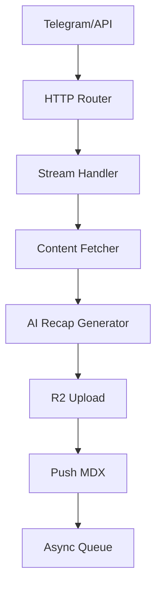

# Example: Complete Document

This is an example of a complete document, based on a real example from the vibe coding docs blog.

---

## Example: 02-ingest-worker.md

```markdown
---
title: 'Ingest Worker'
summary: 'Cloudflare Worker handles content ingestion: receives URLs/text, fetches content, generates AI recap, uploads media, pushes to GitHub. This worker is the core processing layer between input sources and storage.'
read_when:
  - onboarding to the codebase
  - implementing ingestion features
  - debugging content processing
  - integrating input sources
---

# 02-ingest-worker

Cloudflare Worker handles content ingestion: receives URLs/text,
fetches content, generates AI recap, uploads media, pushes to GitHub.
This worker is the core processing layer between input sources and storage.

## System Diagram



## 1. HTTP Routes

| Route | Method | Purpose |
|-------|--------|---------|
| `/ingest` | POST | Main ingestion endpoint |
| `/telegram` | POST | Telegram webhook receiver |
| `/health` | GET | Health check |

## 2. Content Fetching

Worker fetches content from multiple sources:

| Source | Method | Module |
|--------|--------|--------|
| Websites | Defuddle API | `stream.ts` |
| GitHub repos | GitHub API | `stream.ts` |
| YouTube | Windmill service | `stream.ts` |
| PDFs | unpdf library | `pdf.ts` |

## 3. Queue Processing

| Config | Value |
|--------|-------|
| Max batch size | 1 |
| Timeout | 15 min |
| Max retries | 2 |
| Dead Letter Queue | `vilab-ai-dlq` |

## 4. Error Handling

| Error type | Behavior |
|-----------|---------|
| Fetch timeout | Retry up to max_retries |
| AI generation fail | Log + push partial content |
| GitHub push fail | Retry queue, then DLQ |

## File Reference

| File | Purpose |
|------|---------|
| `src/index.ts` | HTTP router, request orchestration |
| `src/stream.ts` | URL fetching, recap generation flow |
| `src/ai.ts` | AI provider abstraction layer |
| `src/queue.ts` | Queue consumer logic |
| `src/pdf.ts` | PDF extraction utilities |

## Cross-References

| Doc | Relation |
|-----|----------|
| [01-content-pipeline](01-content-pipeline.md) | Parent flow — this worker is step 2 |
| [03-telegram-bot](03-telegram-bot.md) | Input source via `/telegram` endpoint |
| [04-ai-providers](04-ai-providers.md) | AI services used in Fetch→AI step |
| [06-media-storage](06-media-storage.md) | R2 storage used in AI→Media step |
```

---

## Why this example is good

| Criteria | ✅ Achieved |
|---------|-----------|
| Complete frontmatter | `title`, `summary`, `read_when` all present and accurate |
| Clear overview | 2 sentences, describes role in system |
| Has diagram | Flowchart TB, 7 clear nodes |
| Tables for config | Queue config in table, not prose |
| Complete File Reference | 5 files with clear purposes |
| Cross-References with context | Not just links but explains relations |
| Token count | ~1050 tokens (including frontmatter) — fits in 1 RAG chunk |
| Single responsibility | Can be described in 1 sentence without "and" |
