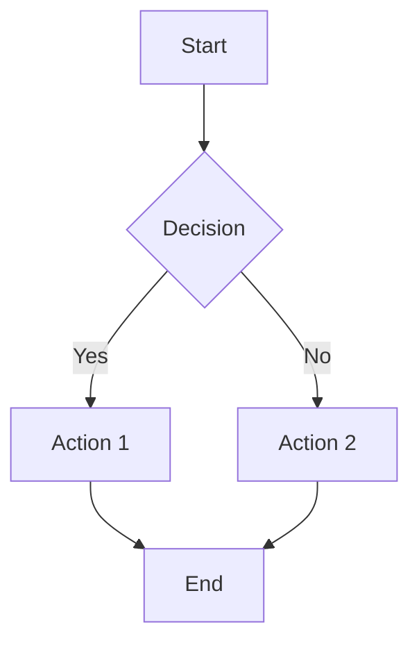
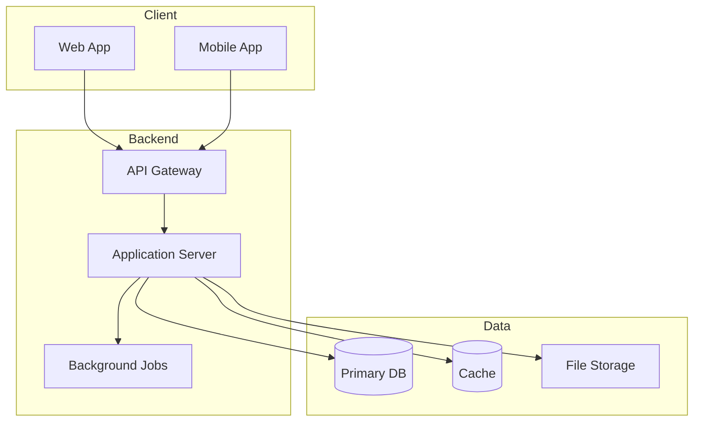

# PRD Template

## Table of Contents
1. [Document Info](#document-info)
2. [Product Overview](#1-product-overview)
3. [User Personas](#2-user-personas)
4. [Feature Requirements](#3-feature-requirements)
5. [User Flows](#4-user-flows)
6. [Non-Functional Requirements](#5-non-functional-requirements)
7. [Technical Specifications](#6-technical-specifications)
8. [Analytics & Monitoring](#7-analytics--monitoring)
9. [Release Planning](#8-release-planning)
10. [Open Questions & Risks](#9-open-questions--risks)
11. [Appendix](#10-appendix)

---

## Document Info

| Field | Value |
|-------|-------|
| Product Name | [Name] |
| Version | 1.0 |
| Last Updated | [Date] |
| Status | Draft |

---

## 1. Product Overview

### 1.1 Product Vision
[Compelling vision statement from idea.md]

### 1.2 Target Users
[Specific user segments from idea.md]

### 1.3 Business Objectives
[Goals from idea.md]

### 1.4 Success Metrics

| Metric | Target | Measurement Method |
|--------|--------|-------------------|
| [Metric 1] | [Target] | [How to measure] |

---

## 2. User Personas

### Persona 1: [Name]
- **Demographics**: Age, occupation, location
- **Goals**: What they want to achieve
- **Pain Points**: Current frustrations
- **User Journey**: How they would use the product
- **Quote**: A representative statement

### Persona 2: [Name]
[Same structure]

---

## 3. Feature Requirements

### 3.1 Feature Matrix

| ID | Feature | Description | Priority | Acceptance Criteria | Dependencies |
|----|---------|-------------|----------|---------------------|--------------|
| F1 | [Feature] | [Description] | Must-have | [Criteria] | [Deps] |

Priority: Must-have, Should-have, Could-have, Won't-have (MVP)

### 3.2 Feature Details

#### F1: [Feature Name]

**Description**: [Detailed description]

**User Stories**:
- As a [user type], I want to [action] so that [benefit]

**Acceptance Criteria**:
- [ ] Criterion 1
- [ ] Criterion 2

**Edge Cases**:
- [Edge case handling]

---

## 4. User Flows

### 4.1 [Primary Flow Name]

**Description**: [What this flow accomplishes]

**Steps**:
1. User [action]
2. System [response]
3. ...

**Alternative Paths**:
- If [condition], then [alternative]

**Error States**:
- [Error]: [How handled]

---

## 5. Non-Functional Requirements

### 5.1 Performance

| Requirement | Target | Notes |
|-------------|--------|-------|
| Page Load Time | < 3s | First contentful paint |
| API Response | < 500ms | 95th percentile |
| Concurrent Users | [Number] | Expected load |
| Uptime | 99.9% | Excluding maintenance |

### 5.2 Security
- **Authentication**: [OAuth 2.0, MFA, etc.]
- **Authorization**: [Role-based access]
- **Data Protection**: [Encryption]
- **Compliance**: [GDPR, HIPAA, etc.]

### 5.3 Compatibility

| Platform | Requirement |
|----------|-------------|
| Browsers | Chrome, Firefox, Safari, Edge (latest 2) |
| Mobile | iOS 14+, Android 10+ |
| Screen Sizes | 320px - 2560px responsive |

### 5.4 Accessibility
- WCAG 2.1 AA compliance
- Keyboard navigation
- Screen reader compatible
- Color contrast requirements

---

## 6. Technical Specifications

### 6.1 System Architecture

### 6.2 Frontend
- **Framework**: [From idea.md]
- **State Management**: [Approach]
- **Design System**: [UI library]
- **Build Tools**: [Bundler]

### 6.3 Backend
- **Framework**: [From idea.md]
- **API Design**: REST / GraphQL
- **Database**: [Type and rationale]
- **Caching**: [Strategy]

### 6.4 Infrastructure
- **Hosting**: [Platform]
- **Scaling**: [Strategy]
- **CI/CD**: [Pipeline]
- **Monitoring**: [Tools]

### 6.5 Third-Party Integrations

| Service | Purpose | Priority |
|---------|---------|----------|
| [Service] | [Purpose] | [Must/Should/Could] |

---

## 7. Analytics & Monitoring

### 7.1 Key Metrics

| Category | Metric | Description | Target |
|----------|--------|-------------|--------|
| Engagement | DAU/MAU | Daily/Monthly active | [Target] |
| Conversion | [Metric] | [Description] | [Target] |
| Retention | [Metric] | [Description] | [Target] |

### 7.2 Events to Track

| Event | Trigger | Properties |
|-------|---------|------------|
| [Event] | [When] | [Data] |

### 7.3 Dashboards
- Executive: High-level KPIs
- Product: Feature usage, flows
- Technical: Performance, errors

### 7.4 Alerts

| Alert | Condition | Severity | Response |
|-------|-----------|----------|----------|
| [Alert] | [Threshold] | [H/M/L] | [Action] |

---

## 8. Release Planning

### 8.1 MVP (v1.0)
**Target Date**: [Date]

**Core Features**:
- [ ] Feature 1
- [ ] Feature 2

**Success Criteria**:
- [Measurable criteria]

**Launch Checklist**:
- [ ] Core functionality complete
- [ ] Analytics in place
- [ ] Security review passed
- [ ] Performance benchmarks met

### 8.2 Version 1.1
**Timeline**: [Relative to MVP]

**Features**:
- [ ] [Should-have features]

### 8.3 Version 2.0
**Timeline**: [Longer term]

**Features**:
- [ ] [Major enhancements]

---

## 9. Open Questions & Risks

### 9.1 Open Questions

| # | Question | Impact | Owner | Due |
|---|----------|--------|-------|-----|
| 1 | [Question] | [H/M/L] | [Who] | [When] |

### 9.2 Assumptions

| # | Assumption | Risk if Wrong | Validation |
|---|------------|---------------|------------|
| 1 | [Assumption] | [Risk] | [How to validate] |

### 9.3 Risks

| Risk | Probability | Impact | Mitigation |
|------|-------------|--------|------------|
| [Risk] | [H/M/L] | [H/M/L] | [Strategy] |

---

## 10. Appendix

### 10.1 Competitive Analysis

| Competitor | Strengths | Weaknesses | Our Differentiation |
|------------|-----------|------------|---------------------|
| [Name] | [Strengths] | [Weaknesses] | [How we differ] |

### 10.2 Glossary

| Term | Definition |
|------|------------|
| [Term] | [Definition] |

### 10.3 Revision History

| Version | Date | Author | Changes |
|---------|------|--------|---------|
| 1.0 | [Date] | [Author] | Initial draft |