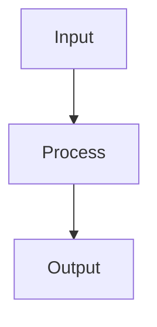

# Doc Skeleton Template

Đây là skeleton chuẩn cho mọi document trong hệ thống vibe coding docs.

---

## Template

```markdown
# NN-domain-name

{2-3 câu mô tả: đây là gì, tại sao nó tồn tại trong system này.
Không dùng bullet list ở đây — viết câu hoàn chỉnh.}

## System Diagram



## 1. {Tên Section 1}

{Mô tả ngắn section này làm gì}

| Column 1 | Column 2 | Column 3 |
|----------|----------|----------|
| value    | value    | value    |

## 2. {Tên Section 2}

{Tiếp tục với numbered sections}

| Config | Value |
|--------|-------|
| key    | value |

## 3. {Tên Section 3 nếu cần}

{Chỉ thêm section nếu thực sự cần thiết}

## File Reference

| File | Purpose |
|------|---------|
| `src/module.ts` | Mô tả ngắn |
| `src/other.ts`  | Mô tả ngắn |

## Cross-References

| Doc | Relation |
|-----|----------|
| [00-architecture](00-architecture.md) | Parent context |
| [NN-related](NN-related.md) | Relation description |
```

---

## Hướng dẫn từng phần

### Overview (2-3 câu)
- Câu 1: Đây là gì (component/module/service gì)
- Câu 2: Nó làm gì / tại sao cần nó
- Câu 3 (optional): Cách nó fit vào system lớn hơn

**Tốt:** "Cloudflare Worker xử lý content ingestion: nhận URLs/text, fetch content, generate AI recap, upload media, push to GitHub."

**Không tốt:** "Module này có nhiều chức năng bao gồm việc xử lý input và output cũng như kết nối với các service khác trong hệ thống."

### System Diagram
- Dùng Mermaid `flowchart TB` hoặc `flowchart LR`
- Chỉ include các nodes quan trọng nhất (5-10 nodes)
- Tên nodes phải khớp với terminology trong sections bên dưới

### Sections (numbered)
- **Luôn dùng số**: "## 1.", "## 2.", không phải "## Routes", "## Config"
- **Tên section mô tả nội dung**: "## 1. HTTP Routes", "## 2. Queue Processing"
- **Config và data → tables, không phải lists hay văn xuôi**

### File Reference
- List tất cả files liên quan trực tiếp đến domain này
- Dùng backticks cho file paths
- Purpose phải ngắn gọn (< 10 words)

### Cross-References
- **Luôn có ít nhất 1 cross-reference** (thường là doc parent/architecture)
- Relation phải rõ ràng: "Parent flow", "Input source", "Uses this module", "See also"
- Dùng relative links: `[00-architecture](00-architecture.md)`

---

## Token budget

| Phần | Token ước lượng |
|------|----------------|
| Overview | 30-50 |
| Diagram | 50-100 |
| Mỗi section với table | 80-150 |
| File Reference | 50-100 |
| Cross-References | 30-60 |
| **Total target** | **800-1500** |

Giữ tổng doc trong khoảng này để vừa 1 RAG chunk.
