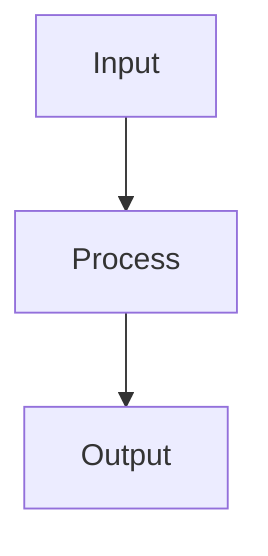

# Doc Skeleton Template

This is the standard skeleton for every document in the vibe coding docs system.

---

## Template

```markdown
# NN-domain-name

{2-3 sentence description: what this is, why it exists in this system.
Don't use bullet lists here — write complete sentences.}

## System Diagram



## 1. {Section 1 Name}

{Brief description of what this section does}

| Column 1 | Column 2 | Column 3 |
|----------|----------|----------|
| value    | value    | value    |

## 2. {Section 2 Name}

{Continue with numbered sections}

| Config | Value |
|--------|-------|
| key    | value |

## 3. {Section 3 Name if needed}

{Only add section if truly necessary}

## File Reference

| File | Purpose |
|------|---------|
| `src/module.ts` | Brief description |
| `src/other.ts`  | Brief description |

## Cross-References

| Doc | Relation |
|-----|----------|
| [00-architecture](00-architecture.md) | Parent context |
| [NN-related](NN-related.md) | Relation description |
```

---

## Section-by-section guide

### Overview (2-3 sentences)
- Sentence 1: What this is (component/module/service)
- Sentence 2: What it does / why it's needed
- Sentence 3 (optional): How it fits into the larger system

**Good:** "Cloudflare Worker handles content ingestion: receives URLs/text, fetches content, generates AI recap, uploads media, pushes to GitHub."

**Not good:** "This module has many functions including processing input and output as well as connecting to other services in the system."

### System Diagram
- Use Mermaid `flowchart TB` or `flowchart LR`
- Only include the most important nodes (5-10 nodes)
- Node names must match terminology in sections below

### Sections (numbered)
- **Always use numbers**: "## 1.", "## 2.", not "## Routes", "## Config"
- **Section names describe content**: "## 1. HTTP Routes", "## 2. Queue Processing"
- **Config and data → tables, not lists or prose**

### File Reference
- List all files directly related to this domain
- Use backticks for file paths
- Purpose must be concise (< 10 words)

### Cross-References
- **Always have at least 1 cross-reference** (usually parent/architecture doc)
- Relation must be clear: "Parent flow", "Input source", "Uses this module", "See also"
- Use relative links: `[00-architecture](00-architecture.md)`

---

## Token budget

| Part | Estimated tokens |
|------|-----------------|
| Overview | 30-50 |
| Diagram | 50-100 |
| Each section with table | 80-150 |
| File Reference | 50-100 |
| Cross-References | 30-60 |
| **Total target** | **800-1500** |

Keep total doc within this range to fit in one RAG chunk.
