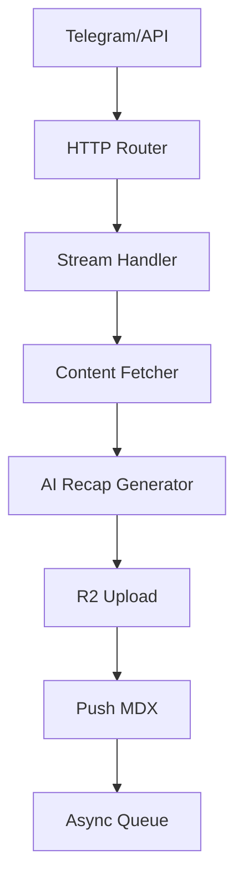

# Example: Complete Document

Đây là ví dụ một document hoàn chỉnh, dựa trên ví dụ thực tế từ blog về vibe coding docs.

---

## Ví dụ: 02-ingest-worker.md

```markdown
# 02-ingest-worker

Cloudflare Worker xử lý content ingestion: nhận URLs/text,
fetch content, generate AI recap, upload media, push to GitHub.
Worker này là core processing layer giữa input sources và storage.

## System Diagram



## 1. HTTP Routes

| Route | Method | Purpose |
|-------|--------|---------|
| `/ingest` | POST | Main ingestion endpoint |
| `/telegram` | POST | Telegram webhook receiver |
| `/health` | GET | Health check |

## 2. Content Fetching

Worker fetch content từ nhiều nguồn:

| Source | Method | Module |
|--------|--------|--------|
| Websites | Defuddle API | `stream.ts` |
| GitHub repos | GitHub API | `stream.ts` |
| YouTube | Windmill service | `stream.ts` |
| PDFs | unpdf library | `pdf.ts` |

## 3. Queue Processing

| Config | Value |
|--------|-------|
| Max batch size | 1 |
| Timeout | 15 min |
| Max retries | 2 |
| Dead Letter Queue | `vilab-ai-dlq` |

## 4. Error Handling

| Error type | Behavior |
|-----------|---------|
| Fetch timeout | Retry up to max_retries |
| AI generation fail | Log + push partial content |
| GitHub push fail | Retry queue, then DLQ |

## File Reference

| File | Purpose |
|------|---------|
| `src/index.ts` | HTTP router, request orchestration |
| `src/stream.ts` | URL fetching, recap generation flow |
| `src/ai.ts` | AI provider abstraction layer |
| `src/queue.ts` | Queue consumer logic |
| `src/pdf.ts` | PDF extraction utilities |

## Cross-References

| Doc | Relation |
|-----|----------|
| [01-content-pipeline](01-content-pipeline.md) | Parent flow — this worker is step 2 |
| [03-telegram-bot](03-telegram-bot.md) | Input source via `/telegram` endpoint |
| [04-ai-providers](04-ai-providers.md) | AI services used in step Fetch→AI |
| [06-media-storage](06-media-storage.md) | R2 storage used in step AI→Media |
```

---

## Tại sao example này tốt

| Tiêu chí | ✅ Đạt được |
|---------|-----------|
| Overview rõ ràng | 2 câu, mô tả đủ role trong system |
| Diagram có | Flowchart TB, 7 nodes rõ ràng |
| Tables cho config | Queue config ở table, không phải văn xuôi |
| File Reference đầy đủ | 5 files với purpose rõ |
| Cross-References có context | Không chỉ link mà còn giải thích relation |
| Token count | ~950 tokens — vừa 1 RAG chunk |
| Single responsibility | Mô tả được trong 1 câu không có "và" |
